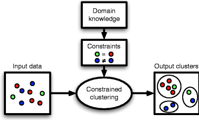

# 🎯 Data Science Project Portfolio 🎯

Welcome to my data science portfolio! Here, you'll find a variety of projects I've worked on, covering data analysis, data engineering, and machine learning. Each project dives into real-world data, uncovering insights through code and visualization.

Take a look around, explore the projects, and feel free to reach out if you have any questions or feedback!

---

## **Constrained Document Clustering**

Domain: Machine Learning, Natural Language Processing (NLP), Information Retrieval, Data Visualization

Tools: Python, Scikit-Learn, Pandas, Numpy, SciPy, YAKE, Matplotlib, Apache ECharts

In this project, I developed a constrained clustering model to enhance the relevance of document clusters, making it easier to analyze and categorize vast amounts of textual data. By integrating domain-specific constraints, the model ensures that clusters are aligned with business needs, leading to more actionable insights from unstructured data.

- **Goal:** Improve the relevance of document clusters by incorporating constraints based on domain-specific requirements.
- **Focus:** Unsupervised learning, clustering algorithms, text preprocessing, feature extraction with YAKE, model evaluation, and result visualization using Apache Echarts.

---

## **Ranked Document Retrieval**

Domain: Information Retrieval, Machine Learning

Tools: Java, Apache Lucene, WEKA, Apache ECharts

This project involved developing a ranked document retrieval system designed to enhance the relevance of search results for large-scale text datasets. By implementing advanced machine learning techniques and integrating external data sources, the system optimizes the accuracy of search results based on user queries.

- **Goal:**  Improve the relevance and accuracy of search results for large text datasets, providing users with important information quickly and efficiently.
- **Focus:** Ranked retrieval algorithms, integration of external data sources, performance analysis, and visualization of system performance using Apache ECharts.

---

## **Sales Performance Dashboard**

Domain: Business Intelligence, Data Visualization
Tools: PowerBI

Explore company sales data through an interactive dashboard! This project helps track performance metrics such as revenue growth, product popularity, and customer satisfaction.

- **Goal:** Build a sales dashboard to provide key performance metrics.
- **Focus:** Data cleaning, pivot tables, and dashboard design in PowerBI.

---
